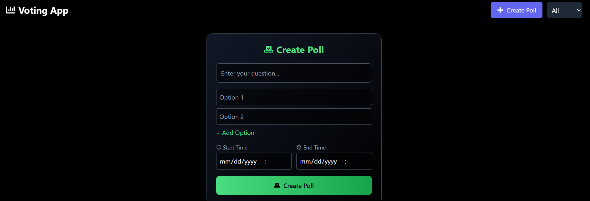
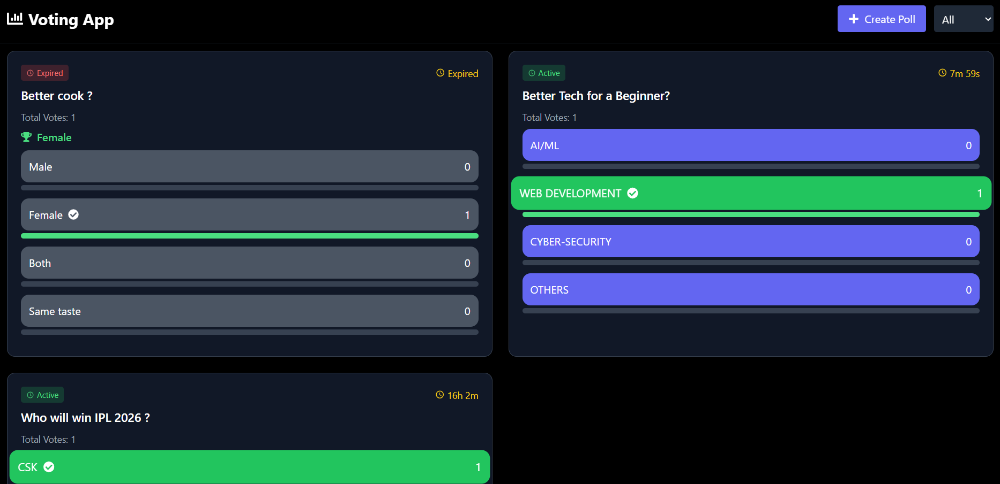
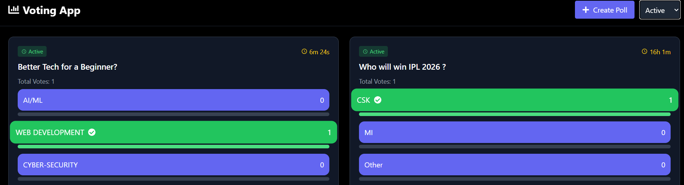
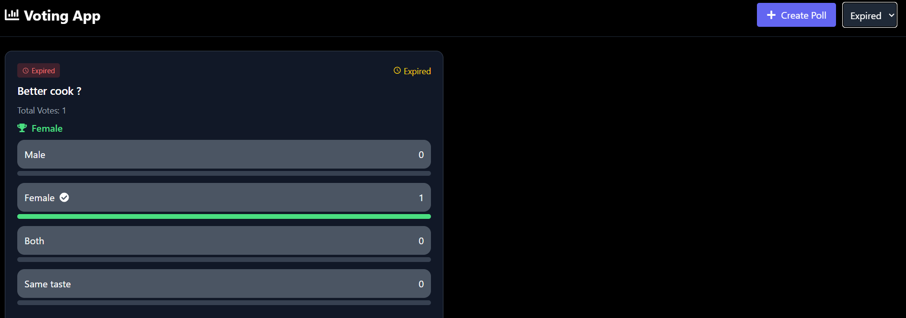

A voting app build with MERN stack 

 ==> Tech Stack
React.js
Node.js
Express.js
MongoDB Atlas
Tailwind CSS
Axios
react-hot-toast

==> Features

Create polls with 2–4 options (min-2 , max-4)
Vote on polls 
Prevent multiple voting using IP tracking (one device one vote)
Start & End time for polls (Mention the date and time that shows timestamp continuously)
Live vote counting
UI with Tailwind CSS (to make it attractive)

==>   Images

Create Voting Poll ------     used to create the poll
Header portion     ------       used to filter the page to show active and expired polls by filter button (contains options _ All, Active and expired)

All Voting polls  -------     shows all polls (new-old , active-expired)

Active Voting polls -------   show all active polls

Expired Poll      --------  

